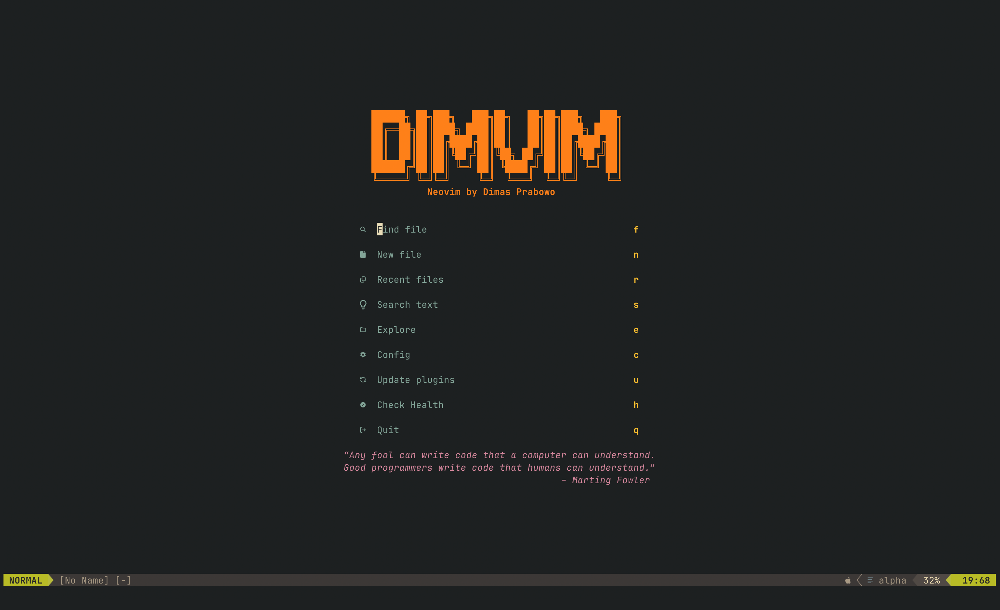

<p align="center">
  
</p>

# Neovim Setup

A modern, minimal yet powerful `neovim` configuration built with Lua, designed for **speed**, **productivity**, and a **great developer experience**.

## Features

- **Modular Lua config** — Easy to read, extend, and maintain
- **Beautiful UI** — Gruvbox theme with `lualine`, and `dashboard-nvim`
- **Fast startup** — Lazy-loaded plugins with `packer.nvim`
- **LSP and Autocompletion** — Powered by `nvim-lspconfig`, `cmp`, and `mason`
- **Fuzzy finding** — Blazingly fast file search with `telescope.nvim`
- **Formatters & Linters** — Managed via `null-ls` and `mason-null-ls`
- **Syntax highlighting** — Tree-sitter for robust and accurate highlighting
- **Git integration** — Git signs and status with `gitsigns.nvim` and `diffview.nvim`
- **File Explorer** — With `nvim-tree.lua` and custom keybindings
- **Session management**, dashboard, and more

## Installation

1. Install Neovim:

```sh
brew install neovim
```

2. Clone this repo into your dotfile directory:

```sh
git clone git@github.com:98prabowo/nvim-setup.git
```

3. Link Neovim setup files to config directory:

```sh
make link
```

4. Start Neovim:

```sh
nvim
```

5. Update Neovim dependency and setup (run inside vim script):

```vim
:Lazy sync
```

6. Open or restart Neovim and enjoy!

## Dependencies

- Neovim >= 0.8 (or 0.10+ for Mason 2.x)
- Git
- Gcc / Clang (C compiler)
- Rust (for Rust LSP)
- Go (for Go LSP)
- Node.js / npm (for some LSPs or formatters)
- Python (optional, for Python LSP)
- Ruby (optional, for Ruby LSP)
- ripgrep, fzf, fd, etc. for telescope
- unzip, wget, curl, gzip, tar, etc. for mason.
- tree-sitter for nvim-tree.

## Key Bindings

|       Action       |     Key      |
| :----------------: | :----------: |
|    File search     | `<leader>ff` |
|     Live grep      | `<leader>fs` |
| Open file explorer | `<leader>e`  |

## Screenshots



## License

MIT License. Feel free to use, fork, and modify.
